## GitHub 仓库卡片

您可以添加链接到 GitHub 仓库的动态卡片，在页面加载时，仓库信息会从 GitHub API 获取。

::github{repo="CuteLeaf/Firefly"}

使用代码 `::github{repo="CuteLeaf/Firefly"}` 创建 GitHub 仓库卡片。

```markdown
::github{repo="CuteLeaf/Firefly"}
```

## 提醒框(Admonitions)配置

Firefly 采用了 [rehype-callouts](https://github.com/lin-stephanie/rehype-callouts) 插件，支持了四种风格的提醒框主题：`GitHub`、`Obsidian`、`VitePress` 和 `Docusaurus`。您可以在 `src/config/siteConfig.ts` 中进行配置：

```typescript
// src/config/siteConfig.ts
export const siteConfig: SiteConfig = {
  // ...
  rehypeCallouts: {
    // 选项: "github" | "obsidian" | "vitepress" | "docusaurus"
    theme: "github",
  },
  // ...
};
```

注意：**更改配置后需要重启开发服务器才能生效。**

以下是各个主题支持的类型列表，每个主题风格和语法不同，可根据喜好选择。

### 1. GitHub 主题风格

这是 GitHub 官方支持的 5 种基本类型。


**基本语法**

```markdown
> [!NOTE] NOTE
> 突出显示用户应该考虑的信息。

> [!TIP] TIP
> 可选信息，帮助用户更成功。

> [!IMPORTANT] IMPORTANT
> 用户成功所必需的关键信息。

> [!WARNING] WARNING
> 关键内容，需要立即注意。

> [!CAUTION] CAUTION
> 行动的负面潜在后果。

> [!NOTE] 自定义标题
> 这是一个带有自定义标题的示例。
```

---

### 2. Obsidian 主题风格

[Obsidian](https://obsidian.md/) 风格支持非常丰富的类型和别名。

<details>
<summary>点击展开 Obsidian 语法列表</summary>

```markdown

> [!NOTE] NOTE
> 通用的笔记块。

> [!ABSTRACT] ABSTRACT
> 文章的摘要。

> [!SUMMARY] SUMMARY
> 文章的总结（同 Abstract）。

> [!TLDR] TLDR
> 太长不看（同 Abstract）。

> [!INFO] INFO
> 提供额外信息。

> [!TODO] TODO
> 需要完成的事项。

> [!TIP] TIP
> 实用技巧或提示。

> [!HINT] HINT
> 暗示（同 Tip）。

> [!IMPORTANT] IMPORTANT
> 重要信息（Obsidian 风格通常使用类似的图标）。

> [!SUCCESS] SUCCESS
> 操作成功。

> [!CHECK] CHECK
> 检查通过（同 Success）。

> [!DONE] DONE
> 已完成（同 Success）。

> [!QUESTION] QUESTION
> 提出问题。

> [!HELP] HELP
> 寻求帮助（同 Question）。

> [!FAQ] FAQ
> 常见问题（同 Question）。

> [!WARNING] WARNING
> 警告信息。

> [!CAUTION] CAUTION
> 注意事项（同 Warning）。

> [!ATTENTION] ATTENTION
> 引起注意（同 Warning）。

> [!FAILURE] FAILURE
> 操作失败。

> [!FAIL] FAIL
> 失败（同 Failure）。

> [!MISSING] MISSING
> 缺失内容（同 Failure）。

> [!DANGER] DANGER
> 危险操作警告。

> [!ERROR] ERROR
> 错误信息（同 Danger）。

> [!BUG] BUG
> 报告软件缺陷。

> [!EXAMPLE] EXAMPLE
> 展示一个例子。

> [!QUOTE] QUOTE
> 引用一段话。

> [!CITE] CITE
> 引证（同 Quote）。

> [!NOTE] 自定义标题
> 这是一个带有自定义标题的示例。
```
</details>


---

### 3. VitePress 主题风格

[VitePress](https://vitepress.dev/) 风格提供了一套现代化的、扁平的默认样式。目前仅包含与 GitHub 一致的 **5 种** 基础类型。

<details>
<summary>点击展开 VitePress 语法列表</summary>

```markdown
> [!NOTE] NOTE
> 对应 GitHub 的 Note。

> [!TIP] TIP
> 对应 GitHub 的 Tip。

> [!IMPORTANT] IMPORTANT
> 对应 GitHub 的 Important。

> [!WARNING] WARNING
> 对应 GitHub 的 Warning。

> [!CAUTION] CAUTION
> 对应 GitHub 的 Caution。

> [!TIP] 自定义标题
> VitePress 风格同样支持自定义标题。
```
</details>


---

### 4. Docusaurus 主题风格

[Docusaurus](https://docusaurus.io/docs/markdown-features/admonitions) 风格提供了一套现代化的提醒框样式，支持 5 种类型。

<details>
<summary>点击展开 Docusaurus 语法列表 </summary>

支持以下类型的提醒框：`note` `tip` `info` `warning` `danger`

```markdown
:::note
突出显示用户应该考虑的信息，即使在快速浏览时也是如此。
:::

:::tip
可选信息，帮助用户更成功。
:::

:::info
一般信息。
:::

:::warning
由于潜在风险需要用户立即注意的关键内容。
:::

:::danger
行动的负面潜在后果。
:::

:::tip[自定义标题]
可选信息，帮助用户更成功。
:::
```

</details>


## Markdown 中 Mermaid 图表完整指南

本段演示如何在 Markdown 文档中使用 Mermaid 创建各种复杂图表，包括流程图、时序图、ER 图、类图、状态图、XY 图、甘特图、思维导图等。

> Mermaid 图表由 [Merman](https://github.com/Latias94/merman) 实现。Firefly 在 Astro 构建阶段生成亮色和深色两套静态 SVG，无需在浏览器中加载 Mermaid 渲染运行时。可以前往 [Merman Playground](http://frankorz.com/merman/) 实时编辑语法并预览渲染结果。

### 流程图示例

流程图非常适合表示流程或算法步骤。


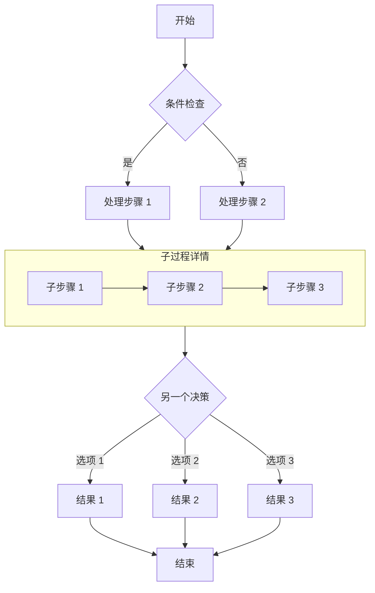

### 时序图示例

时序图显示对象之间随时间的交互。

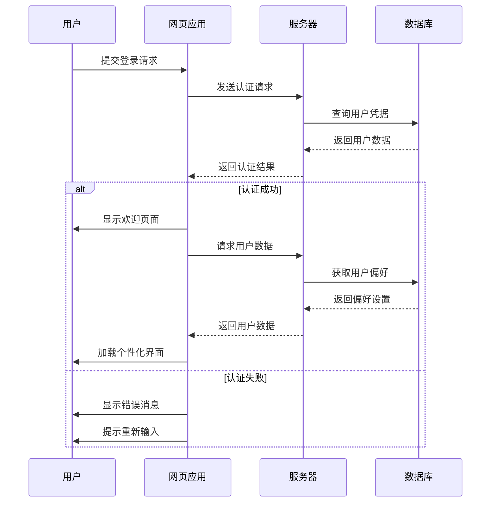

### ER 图示例

ER 图（实体关系图）非常适合表示数据库结构。

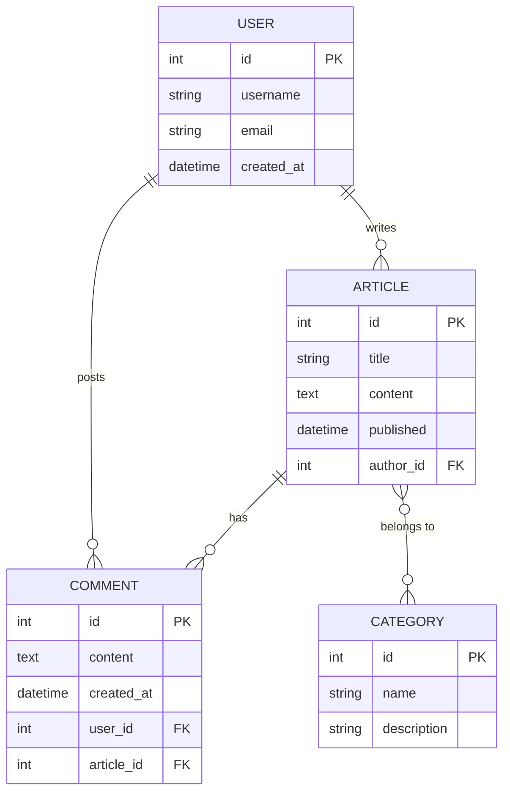

### 类图示例

类图显示系统的静态结构，包括类、属性、方法及其关系。

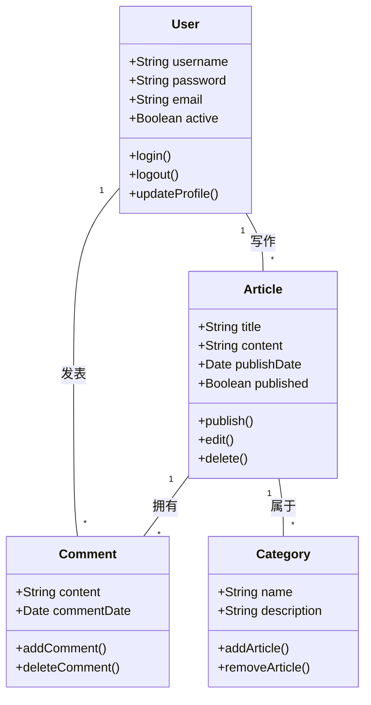

### 状态图示例

状态图显示对象在其生命周期中经历的状态序列。

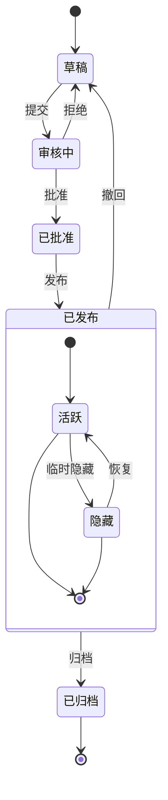

### XY 图示例

XY 图表非常适合展示趋势和对比数据。

```mermaid
xychart-beta
    title "月度访问量趋势"
    x-axis [1月, 2月, 3月, 4月, 5月, 6月]
    y-axis "访问量" 0 --> 5000
    bar [2500, 3200, 4100, 3800, 4500, 4800]
    line [2500, 3200, 4100, 3800, 4500, 4800]
```

### 饼图示例

饼图适合直观展示各部分在整体中的占比。

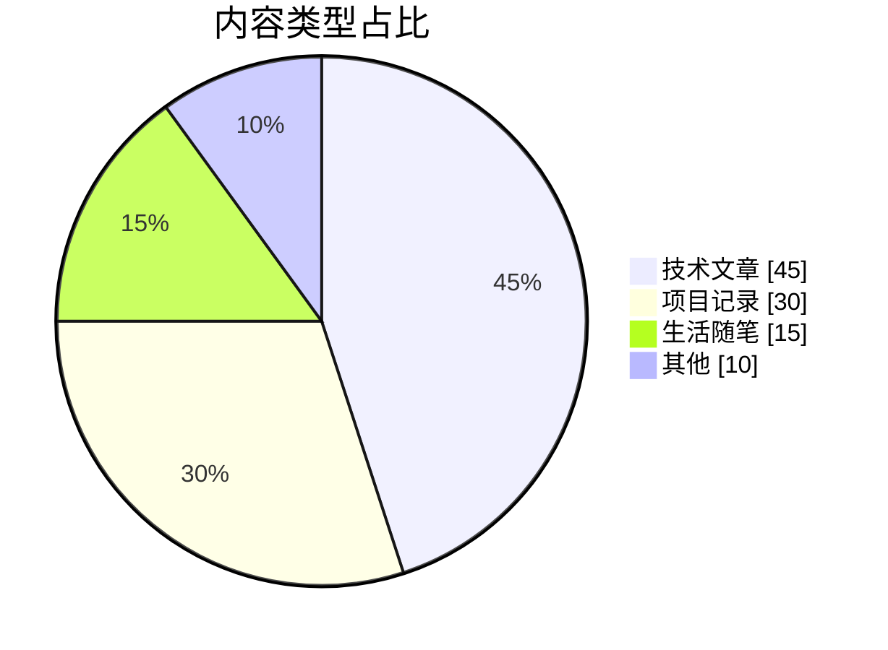

### 甘特图示例

甘特图可以按时间轴展示项目阶段、任务依赖和当前进度。

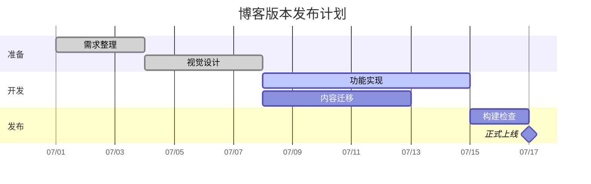

### 思维导图示例

思维导图适合梳理主题层级和知识结构。

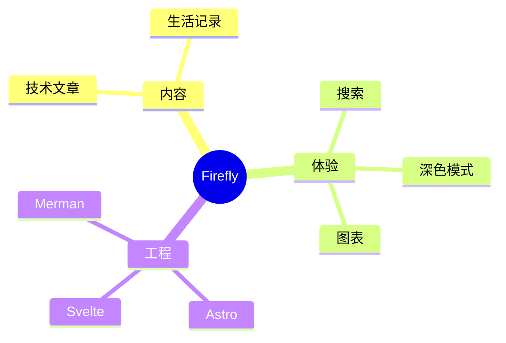

### 时间线示例

时间线用于按年份或阶段呈现项目的重要事件。

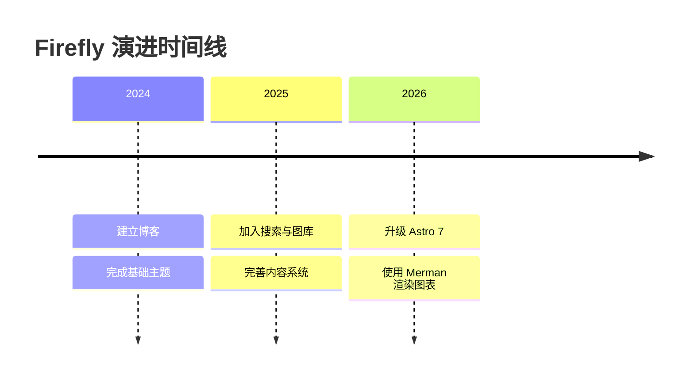

### 用户旅程图示例

用户旅程图能够描述用户在不同阶段的行为和体验评分。

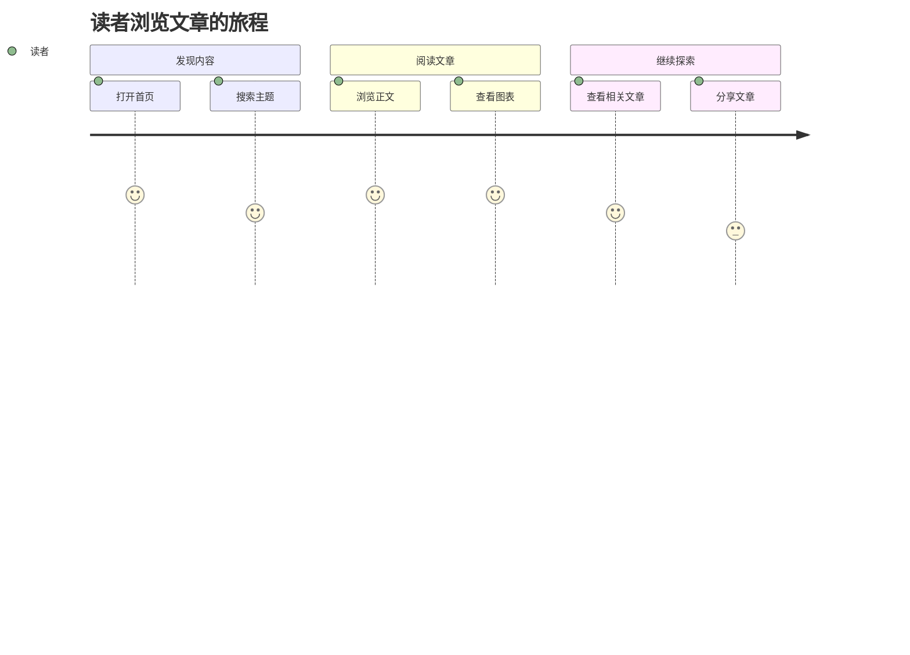

### Git 图示例

Git 图可以清晰展示分支、提交和合并历史。

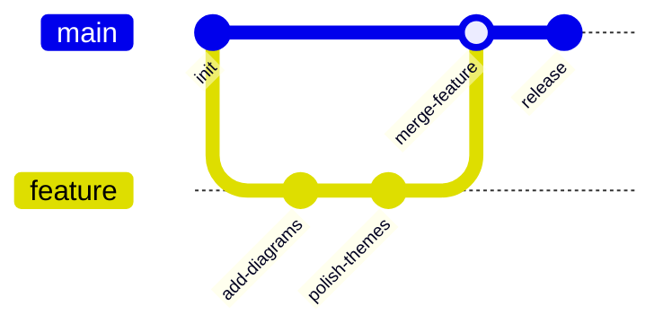

### 看板示例

看板适合展示任务在不同工作阶段之间的分布。

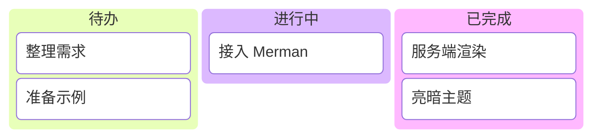

### Sankey 图示例

Sankey 图通过连线宽度展示流量在不同节点之间的流向。

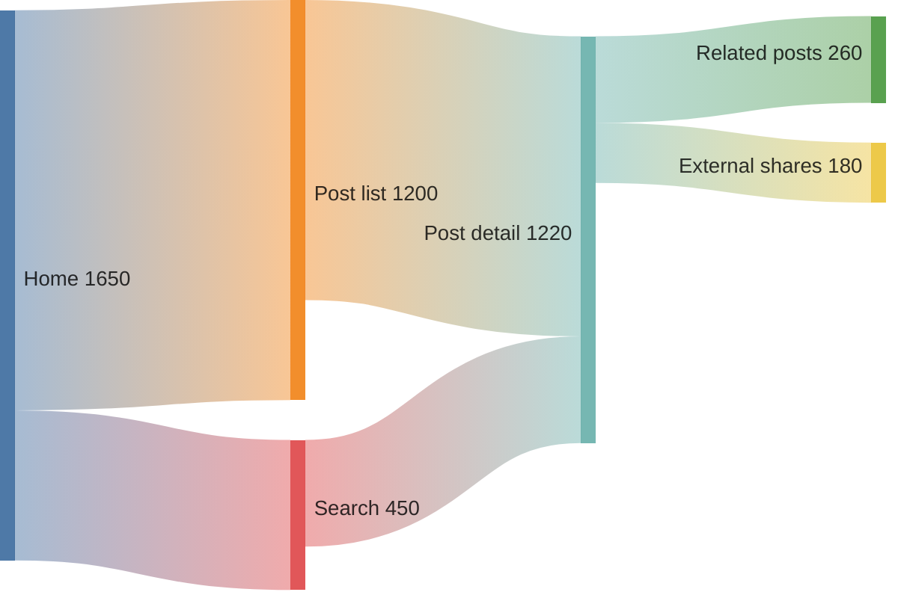

### 总结

Mermaid 是在 Markdown 文档中创建各种类型图表的强大工具。本文演示了流程图、时序图、ER 图、类图、状态图、XY 图、饼图、甘特图、思维导图、时间线、用户旅程图、Git 图、看板和 Sankey 图。这些图表可以帮助您更清晰地表达复杂的概念、流程和数据结构。

要使用 Mermaid，只需在代码块中指定 mermaid 语言，并使用简洁的文本语法描述图表。图表会在构建时自动渲染为 SVG，无需客户端 JavaScript 加载。

可以前往 [Merman Playground](http://frankorz.com/merman/) 尝试更多语法，再将图表代码粘贴到文章中。


## Markdown 中 PlantUML 图表指南

PlantUML 是一种使用纯文本描述图表的工具。你只需要写一段结构化语法，就可以生成时序图、类图、用例图、活动图等常见工程图。

它特别适合写在技术博客和项目文档里：

- 图表和正文一起版本管理，便于协作与审阅
- 修改图只需要改文本，适合频繁迭代
- 能和 Markdown 无缝结合，保持文档统一

在 Firefly 中，`plantuml` 代码块会在构建阶段编码并生成服务器 SVG 地址，页面端再根据亮暗主题自动切换图源，并支持缩放、拖拽和全屏交互。

如果你想快速上手，可以记住这个最小模板：

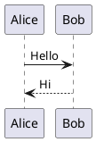

### 活动图示例

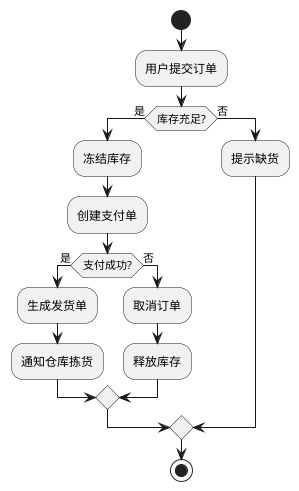

### 状态图示例

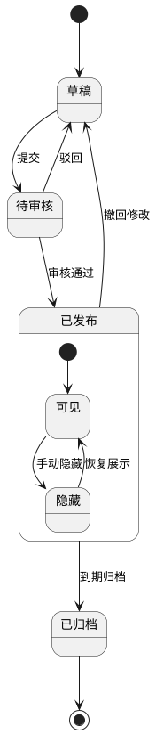

### 用例图示例

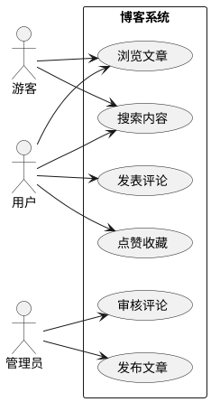

### 组件图示例

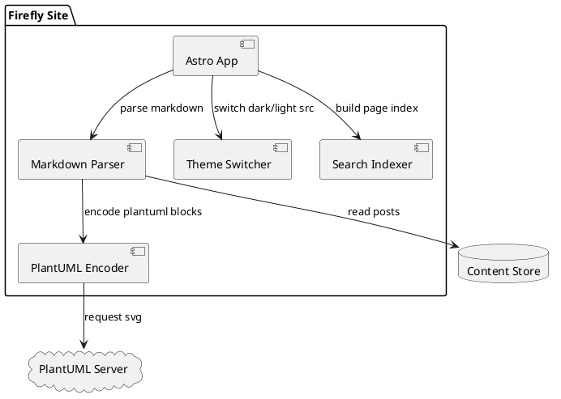

### 部署图示例

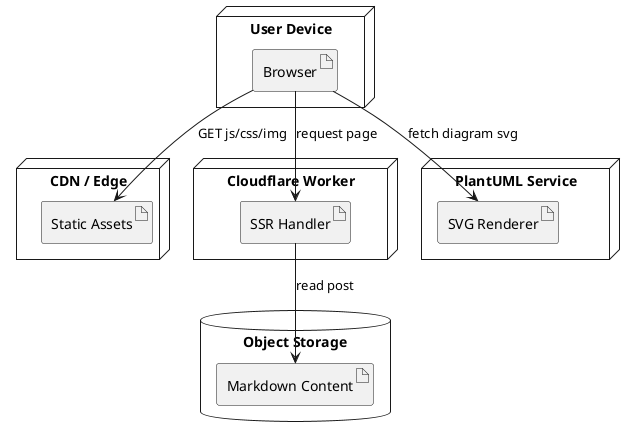

### ER 图示例

```plantuml
@startuml
entity User {
	*id : uuid <<PK>>
	--
	username : varchar
	email : varchar
	created_at : datetime
}

entity Post {
	*id : uuid <<PK>>
	--
	author_id : uuid <<FK>>
	title : varchar
	content : text
	published_at : datetime
}

entity Comment {
	*id : uuid <<PK>>
	--
	post_id : uuid <<FK>>
	user_id : uuid <<FK>>
	body : text
	created_at : datetime
}

User ||--o{ Post : writes
User ||--o{ Comment : creates
Post ||--o{ Comment : has
@enduml
```

### 时序图示例（登录与刷新令牌）

```plantuml
@startuml
autonumber
actor User as 用户
participant Web as 前端页面
participant API as 网关接口
participant Auth as 认证服务
database Redis as 会话缓存

用户 -> 前端页面 : 输入账号密码并提交
前端页面 -> 网关接口 : POST /login
网关接口 -> 认证服务 : 校验凭据
认证服务 -> 会话缓存 : 写入 refresh_token
认证服务 --> 网关接口 : access_token + refresh_token
网关接口 --> 前端页面 : 200 登录成功

... access_token 过期 ...

前端页面 -> 网关接口 : POST /refresh
网关接口 -> 认证服务 : 校验 refresh_token
认证服务 -> 会话缓存 : 轮换 refresh_token
认证服务 --> 网关接口 : 新 access_token
网关接口 --> 前端页面 : 200 新令牌
@enduml
```

### C4 风格容器图示例

```plantuml
@startuml
!includeurl https://raw.githubusercontent.com/plantuml-stdlib/C4-PlantUML/master/C4_Container.puml

Person(user, "博客访客", "阅读文章与搜索内容")

System_Boundary(system, "Firefly Blog") {
	Container(web, "Web App", "Astro + Svelte", "渲染页面与交互")
	Container(worker, "SSR Worker", "Cloudflare Workers", "处理服务端渲染请求")
	ContainerDb(content, "Content Store", "Markdown / Object Storage", "存储文章与资源元数据")
	Container(search, "Search Index", "Pagefind", "提供全文检索")
}

System_Ext(plantuml, "PlantUML Server", "生成 SVG 图表")

Rel(user, web, "访问", "HTTPS")
Rel(web, worker, "请求 SSR 页面", "HTTPS")
Rel(worker, content, "读取文章")
Rel(web, search, "查询关键词")
Rel(web, plantuml, "请求图表 SVG")

LAYOUT_LEFT_RIGHT()
@enduml
```


---

## 剧透

您可以为文本添加剧透。文本也支持 **Markdown** 语法。

内容 :spoiler[被隐藏了 **哈哈**]！

```markdown
内容 :spoiler[被隐藏了 **哈哈**]！
```

## 图片画廊网格 (Image Grid)

您可以使用 `[grid]` 和 `[/grid]` 标签将多张图片纵向并排展示。这对于展示照片画廊或对比图非常有用。系统会自动根据包裹在其中的图片数量（最多支持并排展示4张）以响应式网格进行布局。

**自动补齐图片高度：** 同一排中如果有高度、大小或者比例不一的图片，会像「九宫格画廊相册」一样自动撑满。较短或不协调的图片会自动使用 object-cover 进行完美中心裁剪补充视野。图片边框水平彻底对齐无缝隙，但被裁剪后，只有点击图片通过灯箱才能查看完整图片，所以建议尽量避免使用长宽比例不一致的图片在同一排中。

**图注恒定底端对齐：** 不论上面的图片长宽如何变化，在同一行的所有图像解释文字（图注）都会对标到一条完美的水平基线上了。

[grid]


[/grid]

**基本语法**

```markdown
[grid]


[/grid]
```


---